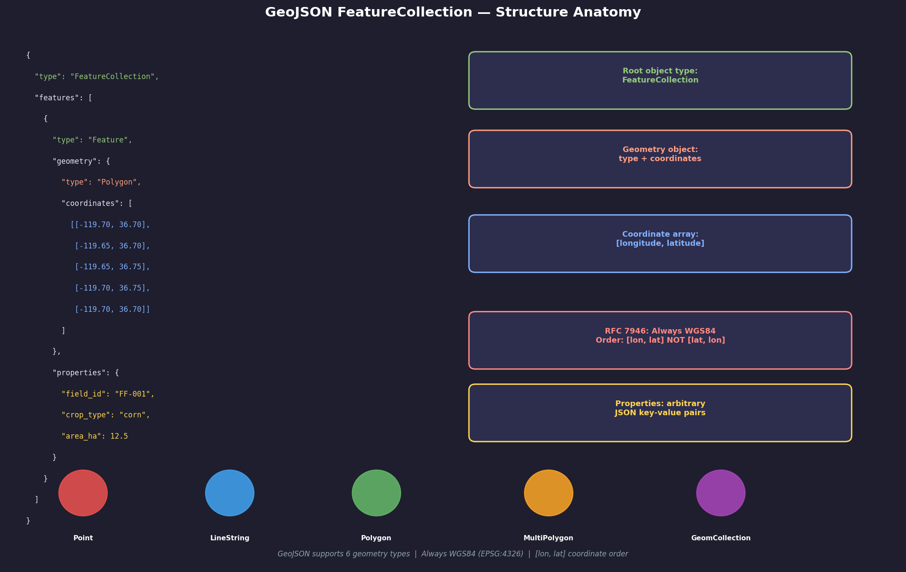
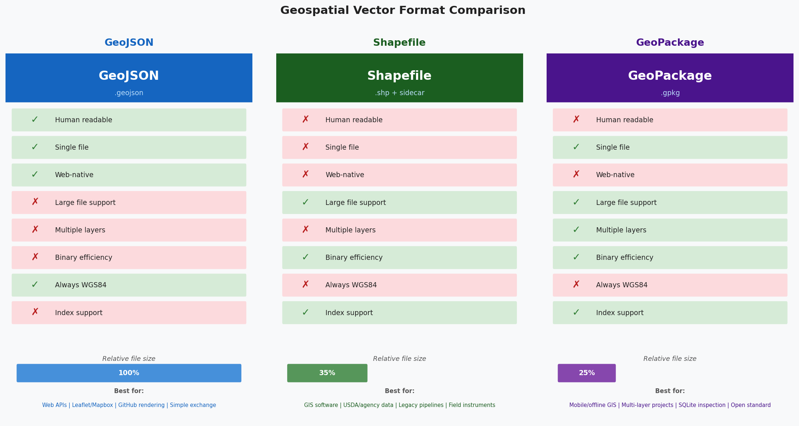
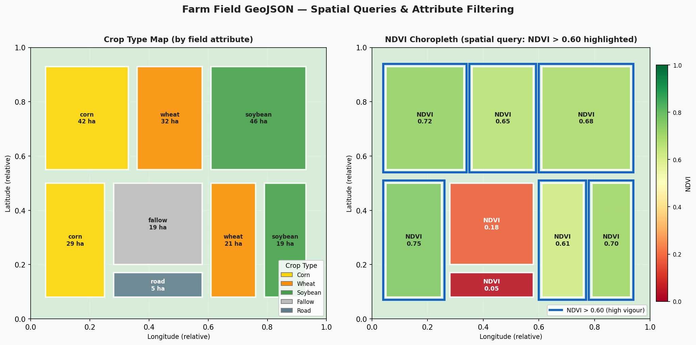

# GeoJSON Processing and Visualization
### From Raw Farm GeoJSON to Interactive Web Maps and Spatial Joins
**Author:** Emmanuel Oyekanlu — Principal Data Engineer

---

## Table of Contents
1. [GeoJSON Specification Overview](#geojson-specification-overview)
2. [GeoJSON vs Shapefile vs TopoJSON](#geojson-vs-shapefile-vs-topojson)
3. [Use in Web Maps and Agricultural Systems](#use-in-web-maps-and-agricultural-systems)
4. [Installation](#installation)
5. [Repository Structure](#repository-structure)
6. [Data Files Overview](#data-files-overview)
7. [Script-by-Script Guide](#script-by-script-guide)
8. [Folium Interactive Maps](#folium-interactive-maps)
9. [GeoJSON in Data Pipelines](#geojson-in-data-pipelines)
10. [Troubleshooting](#troubleshooting)

---

## Visual Gallery

The images below are generated directly from this repository's code using only `matplotlib` and `numpy`.

### GeoJSON Structure Anatomy
Annotated breakdown of a GeoJSON `FeatureCollection` showing the root object, geometry block, coordinate array, and property dict — with RFC 7946 rule callouts.



### Format Comparison: GeoJSON vs Shapefile vs GeoPackage
Side-by-side trait comparison, relative file sizes, and best-use-case guidance for the three dominant vector formats.



### Farm Field Crop Map & NDVI Choropleth
Left: field polygons coloured by crop type (corn, wheat, soybean, fallow). Right: NDVI choropleth with a spatial query highlighting high-vigour fields (NDVI > 0.60).



---

## GeoJSON Specification Overview

GeoJSON (RFC 7946) is a text-based open standard for encoding geographic data structures using JSON. It is the **lingua franca** of modern geospatial web development and a critical format in agricultural data pipelines.

### Core Structure

```json
{
  "type": "FeatureCollection",
  "features": [
    {
      "type": "Feature",
      "geometry": {
        "type": "Polygon",
        "coordinates": [
          [
            [-119.7, 36.7],
            [-119.65, 36.7],
            [-119.65, 36.75],
            [-119.7, 36.75],
            [-119.7, 36.7]
          ]
        ]
      },
      "properties": {
        "field_id": "FF-001",
        "crop_type": "corn",
        "area_ha": 12.5
      }
    }
  ]
}
```

### The 6 GeoJSON Geometry Types

| Geometry Type       | Description                            |
|---------------------|----------------------------------------|
| `Point`             | Single location (lon, lat)             |
| `MultiPoint`        | Array of Points                        |
| `LineString`        | Array of connected points              |
| `MultiLineString`   | Array of LineStrings                   |
| `Polygon`           | Closed ring(s) defining an area        |
| `MultiPolygon`      | Array of Polygons                      |

### Critical RFC 7946 Rules

1. **Coordinate order:** ALWAYS `[longitude, latitude]` — NOT `[lat, lon]`. This trips up many developers coming from GPS APIs that return (lat, lon).
2. **CRS:** GeoJSON is **always WGS84 (EPSG:4326)**. The spec forbids specifying another CRS.
3. **Winding order:** Exterior rings should be counter-clockwise; holes should be clockwise. Many parsers ignore this, but some strict validators enforce it.
4. **Coordinate precision:** 6 decimal places of longitude/latitude ≈ 0.11 m accuracy — sufficient for field-scale agriculture. More digits is pointless and increases file size.
5. **No NaN/Infinity:** Coordinates must be finite numbers.

---

## GeoJSON vs Shapefile vs TopoJSON

| Feature               | GeoJSON             | Shapefile (.shp)    | TopoJSON            |
|-----------------------|---------------------|---------------------|---------------------|
| Format                | JSON text           | Binary + sidecar files | JSON text         |
| Human-readable        | Yes                 | No                  | Yes (harder)        |
| Multi-file            | No (single file)    | Yes (3-7 files)     | No                  |
| Max size (practical)  | ~50 MB (browser)    | Unlimited           | Smaller than GeoJSON|
| Shared boundaries     | Duplicated          | Duplicated          | Encoded once (topo) |
| CRS                   | WGS84 only (RFC)    | Any (via .prj)      | WGS84 or arbitrary  |
| Web browser native    | Yes (JSON.parse)    | No                  | Yes                 |
| PostGIS import        | Easy (`ST_GeomFromGeoJSON`) | Easy (shp2pgsql) | Needs conversion |
| Farm app support      | Universal           | Wide                | Limited             |

**When to use GeoJSON:**
- Web maps (Leaflet, Mapbox GL, Google Maps)
- REST API responses for geospatial data
- File interchange between farm management apps
- Small-to-medium datasets (< 50 MB)
- Version control (human-readable diffs)

**When to use Shapefile:**
- Sharing data with legacy GIS tools (ArcGIS, older QGIS)
- Large datasets where binary storage is more efficient
- When attribute types matter (dates, large integers)

**When to use TopoJSON:**
- Choropleth web maps where adjacent polygon boundaries should be shared
- Significantly reduces file size for complex topologically adjacent features
- D3.js visualizations

---

## Use in Web Maps and Agricultural Systems

### Leaflet / Mapbox

```javascript
// Load a GeoJSON FeatureCollection and add to a Leaflet map
fetch('/api/fields/salinas-valley.geojson')
  .then(r => r.json())
  .then(data => {
    L.geoJSON(data, {
      style: feature => ({
        color: cropColors[feature.properties.crop_type],
        weight: 2,
        fillOpacity: 0.6
      }),
      onEachFeature: (feature, layer) => {
        layer.bindPopup(`
          <b>${feature.properties.field_id}</b><br>
          Crop: ${feature.properties.crop_type}<br>
          Area: ${feature.properties.area_ha} ha
        `);
      }
    }).addTo(map);
  });
```

### PostGIS Integration

```sql
-- Import GeoJSON into PostGIS
INSERT INTO farm_fields (field_id, crop_type, area_ha, geom)
SELECT
  properties->>'field_id',
  properties->>'crop_type',
  (properties->>'area_ha')::float,
  ST_GeomFromGeoJSON(geometry::text)
FROM (
  SELECT
    jsonb_array_elements(:'geojson'::jsonb->'features') AS f,
    f->'properties' AS properties,
    f->'geometry' AS geometry
) sub;
```

### Farm Management System Integrations

- **Climate FieldView API:** Returns field boundaries as GeoJSON FeatureCollections
- **John Deere Operations Center:** Exports field boundaries in GeoJSON
- **Trimble Agriculture:** Supports GeoJSON import/export
- **USDA FSA CropLand Data Layer (CDL):** Available via WCS/WFS as GeoJSON

---

## Installation

```bash
python -m venv venv
# Windows:
venv\Scripts\activate
# macOS/Linux:
source venv/bin/activate

pip install -r requirements.txt
```

**Note on Folium:** Folium creates interactive maps as self-contained HTML files using Leaflet.js. Open the output `.html` file in any browser — no server needed.

---

## Repository Structure

```
03_geojson_processing_and_visualization/
├── README.md
├── requirements.txt
├── .gitignore
├── data/
│   ├── farm_fields.geojson          # 8 Fresno-area agricultural field polygons
│   └── irrigation_zones.geojson     # 3 irrigation district polygons
├── 01_geojson_read_write.py         # geojson library: load, inspect, add feature, write
├── 02_geojson_to_geodataframe.py    # GeoJSON → GeoPandas, filter, export
├── 03_geojson_validation.py         # Structural + coordinate validity checking
├── 04_geojson_spatial_queries.py    # Spatial join: fields ∩ irrigation zones
└── 05_folium_map_visualization.py   # Interactive choropleth map with Folium
```

---

## Data Files Overview

### `data/farm_fields.geojson`
- **Location:** Fresno, CA area (~36.7°N, -119.7°W)
- **Features:** 8 agricultural field polygons
- **Attributes:** `field_id`, `crop_type` (corn/wheat/soy/alfalfa), `area_ha`, `irrigation_type`

### `data/irrigation_zones.geojson`
- **Location:** Same region as farm_fields
- **Features:** 3 irrigation district polygons (some overlap with field polygons)
- **Attributes:** `zone_id`, `zone_name`, `water_source`, `district_code`

---

## Script-by-Script Guide

### `01_geojson_read_write.py`
Uses the `geojson` Python library (not GeoPandas) to load, inspect, programmatically
add a new feature, and write back to a file. Teaches the raw GeoJSON data model.

```bash
python 01_geojson_read_write.py
```

### `02_geojson_to_geodataframe.py`
Converts a GeoJSON file to a GeoPandas GeoDataFrame, performs attribute filtering
(filter by crop type), and exports the filtered result back to GeoJSON.

```bash
python 02_geojson_to_geodataframe.py
```

### `03_geojson_validation.py`
Validates GeoJSON structure and coordinate integrity: checks required keys, geometry
types, coordinate validity (no NaN, correct nesting depth), winding order, and
generates a formatted validation report.

```bash
python 03_geojson_validation.py
```

### `04_geojson_spatial_queries.py`
Loads both farm_fields and irrigation_zones layers, performs a spatial join to
determine which fields overlap which irrigation zones, and exports an enriched GeoJSON.

```bash
python 04_geojson_spatial_queries.py
```

### `05_folium_map_visualization.py`
Creates an interactive Folium web map featuring: a choropleth layer colored by
area_ha, clickable popups with field attributes, layer control, and saves as HTML.

```bash
python 05_folium_map_visualization.py
# Then open map_visualization.html in your browser
```

---

## Folium Interactive Maps

Folium is a Python wrapper around Leaflet.js that generates interactive HTML maps.
Key features used in this repo:

| Feature          | Folium Method                         | Use Case                            |
|------------------|---------------------------------------|-------------------------------------|
| Base map         | `folium.Map()`                        | OpenStreetMap / Satellite base      |
| GeoJSON layer    | `folium.GeoJson()`                    | Display field polygons              |
| Choropleth       | `folium.Choropleth()`                 | Color fields by attribute           |
| Popup            | `folium.GeoJsonPopup()`               | Click to see field details          |
| Tooltip          | `folium.GeoJsonTooltip()`             | Hover to see field name             |
| Layer control    | `folium.LayerControl()`               | Toggle layers on/off                |
| Color maps       | `branca.colormap`                     | Color scales for choropleth         |

---

## GeoJSON in Data Pipelines

### Airflow DAG Pattern

```python
# Example: Daily field boundary refresh DAG
from airflow import DAG
from airflow.operators.python import PythonOperator
import geopandas as gpd

def refresh_field_boundaries(**context):
    # Pull from farm management API
    gdf = gpd.read_file("https://api.farmapp.com/fields.geojson")
    # Validate and enrich
    gdf = gdf[gdf.geometry.is_valid]
    gdf_utm = gdf.to_crs("EPSG:32610")
    gdf_utm['area_ha'] = gdf_utm.geometry.area / 10_000
    # Write to S3
    gdf.to_file("s3://bucket/fields_enriched.geojson", driver='GeoJSON')

with DAG('field_boundary_refresh', schedule_interval='@daily') as dag:
    refresh = PythonOperator(
        task_id='refresh_field_boundaries',
        python_callable=refresh_field_boundaries,
    )
```

### Streaming GeoJSON via API

```python
# FastAPI endpoint serving GeoJSON
from fastapi import FastAPI
import geopandas as gpd

app = FastAPI()

@app.get("/api/fields/{region}", response_class=JSONResponse)
def get_fields(region: str, crop_type: Optional[str] = None):
    gdf = gpd.read_postgis(
        f"SELECT * FROM fields WHERE region = '{region}'",
        con=engine, geom_col='geom'
    )
    if crop_type:
        gdf = gdf[gdf['crop_type'] == crop_type]
    return json.loads(gdf.to_json())   # GeoDataFrame.to_json() returns GeoJSON string
```

---

## Troubleshooting

**`json.JSONDecodeError`**
→ Your GeoJSON file has a syntax error. Use `python -m json.tool file.geojson` to validate JSON.

**`ValueError: Input shapes do not have the same CRS`**
→ One GeoDataFrame is in WGS84 and another in UTM. Use `.to_crs()` to align them before sjoin.

**Folium map is blank / no features**
→ Check that your GeoJSON coordinates are in (longitude, latitude) order.
→ Verify the map center (latitude, longitude) is near your data.

**`KeyError: 'geometry'`**
→ The GeoJSON file is missing the `geometry` key in some features, or features are null.

**Large GeoJSON slow in browser**
→ Simplify polygon geometries before writing: `gdf.geometry.simplify(0.0001)` for WGS84 data.

---

*Built by Emmanuel Oyekanlu — Principal Data Engineer*
*Specializing in AGV/AMR systems, precision agriculture, and geospatial data pipelines.*
